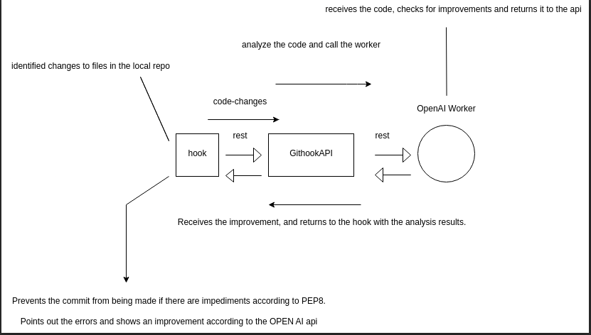

# Githook Arqmeds
This is a precommit hook that calls an API as a service, which validates the modified files to meet the 
PEP8 requirements.




## Project installation:
- 1: Download: [Just Click me](https://github.com/kaiqueBellmont/arqmeds_git_hook/archive/refs/heads/master.zip)
- OR
- 1: Clone the project or download the folder with the following command:
- Clone the project:

```python
git clone https://github.com/kaiqueBellmont/arqmeds_git_hook.git
```
## Important:
### Extract the hook folder to the root of the project.
#### e.g:
```python
root 
   |___ folder1
   |___ folder2
   |___ file...
   |___ hook/...
```
### In The ROOT:
#### install (venv):
```python
pip install  -r hook/requeriments.txt
```
#### install (poetry):
```python
poetry add click requests && poetry lock
```

#### requeriments:

```python
python = "^3.10"
click = "^8.1.3"
requests = "^2.29.0"
```

#### Create pre-commit-file: 
```python
cd hook/cli/ && poetry run python3  cli.py && cd ../..
```
**This will create a pre-commit file inside the root/.git/hooks folder.**

### Pre-commit is already installed.
### But to make it work, you need to install at least gitHookAPI:
```python
git clone https://github.com/kaiqueBellmont/githookAPI.git
```
### GitHookAPI:
#### Let's go to the next [README](https://github.com/kaiqueBellmont/githookAPI/blob/master/README.md)

### OpenAIWorker:
#### Let's go to the last one [README](https://github.com/kaiqueBellmont/openAPIWorker/blob/master/README.md)

## Important:
### The HOOK only works for modified files already added to the git index and .py!!!
E.G:
```python
git add filename.py 
```
#### Now any .py file you try to commit will go through pre-commit
```python
git commit -m file.py "my message"
```

**or by ide also works. (tested in pycharm)**